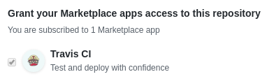
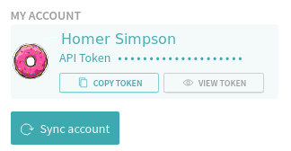
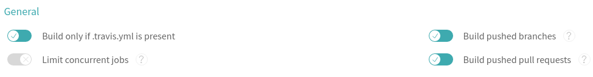

# Cookiecutter templates CLI tool
[](https://travis-ci.com/qbicsoftware/cookiecutter-templates-cli)[](https://codecov.io/gh/qbicsoftware/cookiecutter-templates-cli)

## Table of contents
- [Cookiecutter templates CLI tool](#cookiecutter-templates-cli-tool)
  * [Table of contents](#table-of-contents)
  * [Motivation](#motivation)
  * [Available templates](#available-templates)
  * [Structure of this repository](#structure-of-this-repository)
  * [Installing the required tools](#installing-the-required-tools)
    + [1. Python](#1-python)
    + [2. Java](#2-java)
    + [3. Maven](#3-maven)
    + [4. Other tools](#4-other-tools)
  * [Making sure it all went fine](#making-sure-it-all-went-fine)
  * [Usage](#usage)
    + [Introduction](#introduction)
      - [Global variables](#global-variables)
      - [Variables that apply only for portlets and command-line tools](#variables-that-apply-only-for-portlets-and-command-line-tools)
      - [Variables that apply only for portlets](#variables-that-apply-only-for-portlets)
    + [Location of generated code](#location-of-generated-code)
    + [Change output folder](#change-output-folder)
    + [Provide values without using prompts](#provide-values-without-using-prompts)
    + [Provide values without editing `cookiecutter.json` files](#provide-values-without-editing--cookiecutterjson--files)
      - [1. Providing values via the command-line](#1-providing-values-via-the-command-line)
      - [2. Providing values using a `.cookiecutterrc` file](#2-providing-values-using-a--cookiecutterrc--file)
  * [Layout of the generated projects](#layout-of-the-generated-projects)
  * [What to do once you've generated your project?](#what-to-do-once-you-ve-generated-your-project-)
    + [Write tests, check code coverage](#write-tests--check-code-coverage)
    + [Test your code locally](#test-your-code-locally)
      - [Testing a portlet locally using Jetty](#testing-a-portlet-locally-using-jetty)
      - [Testing CLI tools locally](#testing-cli-tools-locally)
    + [Create a new GitHub repository for your new project](#create-a-new-github-repository-for-your-new-project)
    + [Check that everything worked in Travis-CI.com](#check-that-everything-worked-in-travis-cicom)
    + [Deploying your project as a Maven artifact](#deploying-your-project-as-a-maven-artifact)
    + [Publishing your first version](#publishing-your-first-version)
    + [Change default branch](#change-default-branch)
    + [Getting slack notifications from Travis CI (optional)](#getting-slack-notifications-from-travis-ci--optional-)

## Motivation
There is a lot of boilerplate code associated to building Vaadin portlets for Liferay portals, so it makes sense to automate their creation by using templates. 

We first started by using [cookiecutter templates][cookiecutter] to generate a sample Liferay/Vaadin portlet based on [Maven][maven], but we have now created templates for other kinds of Java projects: command-line tools, portal and generic libraries, as well as added detailed documentation for developers.

## Available templates
* Vaadin Portlet running on Liferay: this is your common, run-of-the-mill portlet.
* Command-line tools: tools to be used using a console (e.g., [qpostman-cli](https://github.com/qbicsoftware/postman-cli)).
* Services: these are similar to command-line tools in their structure, but once a service has been started, it stays "active" until shutdown, like our [portlet deployer service](https://github.com/qbicsoftware/portlet-deployer-service).
* Portlet libraries: libraries using Liferay and Vaadin dependencies (e.g., [portal-utils-lib](https://github.com/qbicsoftware/portal-utils-lib)).
* Generic Java libraries: libraries that don't have Vaadin or Liferay as dependencies (e.g., [openbis-client-lib](https://github.com/qbicsoftware/openbis-client-lib)).

## Structure of this repository
This is a simplified view of the structure of this repository:

```bash
.
├── common-files
│   
└── cookiecutters
    ├── cli
    │   ├── {{ cookiecutter.artifact_id }}
    │   │   ├── pom.xml
    │   │   └── src
    │   └── cookiecutter.json
    ├── generic-lib
    │   ├── {{ cookiecutter.artifact_id }}
    │   │   ├── pom.xml
    │   │   └── src
    │   └── cookiecutter.json
    ├── portal-lib
    │   ├── {{ cookiecutter.artifact_id }}
    │   │   ├── pom.xml
    │   │   └── src
    │   └── cookiecutter.json
    └── portlet
        ├── {{ cookiecutter.artifact_id }}
        │   ├── pom.xml
        │   └── src
        └── cookiecutter.json
 ```

The first thing you will probably notice is the strange name, `{{ cookiecutter.artifact_id }}`, given to some folders. [Cookiecutter][cookiecutter] is able to dynamically resolve variables found in text files and file names. This is a great feature, because the name of the *root folder* of our projects should match the artifact ID, as defined in the `pom.xml` file. 

Notice how each of available templates has its own sub-folder under `cookiecutters` (e.g., the `cookiecutters/generic-lib` folder contains code specific for generic Java libraries). However, since our projects have a few files in common, we have also created a `common-files` folder.

## Installing the required tools
You will first need access to the [QBiC Software GitHub organization](https://github.com/qbicsoftware) so you can create your own GitHub repository and contribute to our codebase.

There are a few development tools you will need to write portlets and other applications in QBiC. We use Java and [Maven][maven] for portal development. This tool, however, requires Python because it is based in [Cookiecutter][cookiecutter], which is a Python-based tool. In other words, to work on a portlet or other QBiC applications, you require only Java and [Maven][maven], but to automate the creation of new projects, you require Python.

### 1. Python
We use [Cookiecutter][cookiecutter], a Python-based tool to create new QBiC software projects using templates. We also maintain and develop a collection of Python tools for non-portal development (e.g., https://github.com/qbicsoftware/etl-scripts, https://github.com/qbicsoftware/barcode-creation). However, for standard QBiC portal projects, such as portlets, you need Python only to generate new projects. 

We strongly recommend using the latest version of the [Conda][conda] package manager because we will soon release this and other QBiC tools as [Conda][conda] packages (see: https://github.com/qbicsoftware/cookiecutter-templates-cli/issues/7). 

Once you have installed [Conda][conda], create a [Conda environment](https://conda.io/docs/user-guide/tasks/manage-environments.html) on which you will install all required Python dependencies:
```bash
conda create --channel conda-forge --name qbic cookiecutter python=3
```

Your `qbic` environment will have the required dependencies (Python 3 and [Cookiecutter][cookiecutter]).

### 2. Java
Our production and test instances use [OpenJDK 1.8](http://openjdk.java.net/). Installation of OpenJDK varies across operating systems. So it is strongly advised to read more about how to install OpenJDK in your operating system. Most Linux-based operating systems offer OpenJDK through package managers (e.g., `pacman`, `apt`, `yum`) and [there seems to be an OpenJDK version for Windows available](https://stackoverflow.com/questions/5991508/openjdk-availability-for-windows-os).

Make sure you install a Java development kit (JDK) and not a Java runtime environment (JRE). 

### 3. Maven
[Apache Maven][maven] is one of those rare tools whose true purpose might be hard to grasp in the beginning, yet it is extremely easy to install. If this is your first time using [Maven][maven], make sure to read [Maven in 5 minutes](https://maven.apache.org/guides/getting-started/maven-in-five-minutes.html) and [Maven's getting started guide](https://maven.apache.org/guides/getting-started/index.html). 

It is up to you to decide whether to install [Maven][maven] using your favorite package manager (you can also install it using [Conda][conda]) or [install it manually](https://maven.apache.org/install.html). In any case, make sure you install the most recent version available.

### 4. Other tools
We use the [Travis CI client][travis-console] to [generate encrypted credentials](#deploying-your-project-as-a-maven-artifact). You can follow [this guide](https://github.com/travis-ci/travis.rb#installation) to get the [Travis CI client][travis-console] installed on your machine.

Installation is straightforward most of the times. If you are using a Fedora-based operating system and you get a "Failed to build gem native extension" error, you might want to [read more about the origin of the problem](https://developer.fedoraproject.org/tech/languages/ruby/gems-installation.html). 


## Making sure it all went fine
This is a fairly new tool, so, for now, you will first need to clone this repository. **Make sure to update your local copy regularly** (i.e., by using `git pull`) so you won't miss the latest features and bug fixes. This is a command-line tool, so having a terminal open while you read this guide would be useful.

As explained in the [requirements section](#installing-the-required-tools), you will need Python and [Cookiecutter][cookiecutter] to create a new project off a template. If you followed our recommendations, you will now have to *activate* your [Conda environment](https://conda.io/docs/user-guide/tasks/manage-environments.html):

```bash
conda activate qbic
```

If this fails, the printed warnings/errors are pretty self-explanatory, but have in mind that the `conda activate` command [has been made available in version 4.4](https://conda.io/docs/release-notes.html#new-feature-highlights).

To test that you have installed all required tools to generate new projects, invoke the main script of this project:

```bash
./generate.py --help
```

Note: `generate.py` is an executable Python script. However, if you are using Windows, you might need to invoke the script as shown here:

```bash
python generate.py --help
```

`generate.py` helps you automate the task of creating a new project. It is located at the root folder of this repository. 

## Usage
### Introduction
To generate a specific template, use the `-t`/`--type` parameter:

```bash
./generate.py --type <type>
```

Supported types are `portlet`, `cli`, `portal-lib` and `generic-lib`, so if you want to generate a Vaadin portlet for Liferay, you would run the following command:

```bash
./generate.py --type portlet
```

Regardless of which template type you are using, you will immediately see that you are prompted to enter some values, as shown here:

```bash
author [Winnie Pooh]: Homer Simpson
email [winnie.the.pooh@qbic.uni-tuebingen.de]: simpson@burns.com
artifact_id [sample-portlet]: donut-portlet
display_name [Sample Portlet]: Donut Portlet
version [1.0.0-SNAPSHOT]: 
short_description [Will never portLET you go.]: Mmm donuts
copyright_holder [QBiC]: Mr. Burns
main_class [SamplePortletUI]: DonutPortletUI
Select use_openbis_client:
1 - yes
2 - no
Choose from 1, 2 [1]: 1
Select use_openbis_raw_api:
1 - yes
2 - no
Choose from 1, 2 [1]: 2
Select use_qbic_databases:
1 - yes
2 - no
Choose from 1, 2 [1]: 1
```

The values shown between brackets are the defaults. To use the default value (as Homer did here for `version`), simply press `ENTER` without entering any other text. Default values are found in `cookiecutter.json` files (there's one for each template type) and in [Cookiecutter's configuration file](http://cookiecutter.readthedocs.io/en/latest/advanced/user_config.html).

Let's first go through the meaning of each variable. 

#### Global variables
**All project types** have references to these variables:
* `author`: your real name, unless you are in the EU witness-protection program or have a really cool nickname, like Rocketboy or Aquagirl.
* `email`: the electronic address that one ought to use if one were willing to contact thee with matters related to the project you are creating.
* `artifact_id`: recall that all [Maven][maven] artifacts (i.e., distributable pieces of software) are identified by three fields, namely, `groupId`, `artifactId`, `version`. This `artifact_id` refers to _that_ `artifactId` in your `pom.xml`. All of our artifacts have the same `groupId`, namely `life.qbic`. Check our naming and versioning conventions guide if you are not sure about which value to enter.
* `display_name`: the "human-friendly" name of your portlet, e.g., _Problem Generator Portlet_, _Project Wizzard (sic) Support Library_, _The "rm -Rf *" Companion Portlet_.
* `version`: if this is a new project, use the default, but if you are migrating a project, maybe you should consider a major version update. In any case, consider our naming and versioning conventions guide.
* `short_description`: a short set of words that, when put together in a sentence, explain what your project does. You know, _short description_ of your project.
* `copyright_holder`: talk to our lawyers about this one or simply use the provided default value. We are not allowed to explain this one anymore since the accident.

#### Variables that apply only for portlets and command-line tools
The `main_class` variable is used **only by `portlet` and `cli` projects**. This kind of projects require a so-called "main (Java) class" with which a framework or a user interacts. The value of this variable depends on what kind of project you are developing/porting, but it refers to the [simple name](https://docs.oracle.com/javase/8/docs/api/java/lang/Class.html#getSimpleName--) of a class (i.e., `Sample` is the simple name of class whose fully qualified name is `foo.bar.Sample`):
* In the case of portlets, this refers to the simple name of the class that extends the [`com.vaadin.ui.UI` class](https://vaadin.com/api/7.7.2/com/vaadin/ui/UI.html). All Tomcat, Liferay and Vaadin configuration files assume that your class belongs in the `life.qbic.portal.portlet` package. For new portlets, this should not be a problem, but if you are migrating a portlet and want to benefit from this tool, you must refactor your code to reflect this restriction.
* For CLI tools this means the simple name of the class that contains your [`public static void main(String[] args)` method](https://docs.oracle.com/javase/tutorial/getStarted/application/index.html).

#### Variables that apply only for portlets
By now, you might have realized that even the simplest portlet requires several configuration files and a cup of coffee. Trying to figure out why your portlet is not deploying or what exactly a configuration file is missing are tasks where developers' time is simply wasted. So we naturally put a lot of effort in first automating portlet generation. This is why the sample portlet that this tool generates is by far the most complex: you can even configure its "sample functionality". The following variables **apply only to portlets**:
* `use_openbis_client`: whether your portlet will interact with openBIS through our [openBIS client](https://github.com/qbicsoftware/openbis-client-lib).
* `use_openbis_raw_api`: if you are accessing openBIS _by the book_, then you probably know what you are doing, so this one needs no further explanation.
* `use_qbic_databases`: for now, we define two kinds of databases: openBIS and the rest. This is _the rest_. If your portlet uses a custom database outside openBIS, you probably need this.

### Location of generated code
`generate.py` will create your project folder in the `generated` folder. All templates generate a very simple sample project and each project will get its own folder. The name of the generated folder is determined by the value of the ``{{ cookiecutter.artifact_id }}`` variable (i.e., ``donut-portlet`` in our example). So in this case, you will see your generated sample porlet in the folder `generated/donut-portlet`. You can now think of this folder as your local GitHub repository, feel free to move it to a more convenient location (e.g., `/home/simpson/projects`).

### Change output folder
If you want your created projects to be placed somewhere else, you can use the `-o`/`--output-dir` argument to instruct `generate.py` to place its output somewhere else:

```bash
./generate.py --type portal-lib --output-dir /home/simpson/projects
```

### Provide values without using prompts
If you do not want to be asked for values, you can use the `--no-input` flag:

```bash
./generate.py --type portal-lib --no-input
```

This will use whichever values are stored in the corresponding `cookiecutter.json` file. In the example above, the defaults values will be loaded from `cookiecutters/portal-lib/cookiecutter.json`. 

### Provide values without editing `cookiecutter.json` files
But what if you do not want to edit `cookiecutter.json` files everytime? There are two ways to assign values to variables without having to edit those pesky `cookiecutter.json` files.

#### 1. Providing values via the command-line
You can use positional arguments in the form of `name=value`, like so:

```bash
./generate.py --type cli --no-input artifact_id=sample-cli version=1.1.0-SNAPSHOT
```

Values provided via the command-line will always override values provided in `cookiecutter.json` files and in [your Cookiecutter user configuration file](#).

#### 2. Providing values using a `.cookiecutterrc` file
After repeatedly using this tool, you will surely become annoyed at the fact that you have to type your name and your email address over and over, even though they haven't changed in the last couple of years. Luckily, [Cookiecutter offers a global configuration file](http://cookiecutter.readthedocs.io/en/latest/advanced/user_config.html). Create a file named `.cookiecutterrc` in your home folder (this varies across operating systems) and include your *global defaults* in it as shown here:

```bash
default_context:
  author: "Homer Simpson"
  email: "simpson@burns.com"
```

Now, every time Homer uses this tool, his global default values will be used and he will be able to simply press enter and use them:

```bash
./generate.py ...

author [Homer Simpson]:
email [simpson@burns.com]:
# ... and so on...
```

Values found in your `.cookiecutterrc` file will only override values provided in `cookiecutter.json` files.

## Layout of the generated projects
`generate.py` will generate a folder which you can immediately use for development. The contents differ across template types. Here, for the sake of clarity, we will keep using our sample portlet, `donut-portlet`. Portlets are, by far, the most intricate template types because there are many files you have to configure properly for your portlet to work properly. Have a look at the generated structure:

```bash
donut-portlet/
├── CODE_OF_CONDUCT.md
├── LICENSE
├── pom.xml
├── README.md
└── src
    ├── main
    │   ├── java
    │   │   └── life
    │   │       └── qbic
    │   │           └── portal
    │   │               └── portlet
    │   │                   └── DonutPortletUI.java
    │   ├── resources
    │   │   ├── life
    │   │   │   └── qbic
    │   │   │       └── portlet
    │   │   │           └── AppWidgetSet.gwt.xml
    │   │   ├── log4j2.xml
    │   │   └── portlet.properties
    │   └── webapp
    │       ├── VAADIN
    │       │   └── themes
    │       │       └── mytheme
    │       │           ├── addons.scss
    │       │           ├── mytheme.scss
    │       │           ├── styles.css
    │       │           └── styles.scss
    │       └── WEB-INF
    │           ├── liferay-display.xml
    │           ├── liferay-plugin-package.properties
    │           ├── liferay-portlet.xml
    │           ├── portlet.xml
    │           └── web.xml
    └── test
        └── java
            └── life
                └── qbic
                    └── portal
                        └── portlet
                            └── DonutPortletUITest.java
```

In oder to understand more about the process of creating projects from templates by using [Cookiecutter][cookiecutter] and this tool, compare this [template web.xml](https://github.com/qbicsoftware/cookiecutter-templates-cli/blob/development/cookiecutters/portlet/%7B%7B%20cookiecutter.artifact_id%20%7D%7D/src/main/webapp/WEB-INF/web.xml) with `donut-portlet/src/webapp/WEB-INF/web.xml`. As a side note, the `web.xml` is also referred to as a _servlet descriptor_. Our portlets run on a Liferay portal, which in turn is hosted as a series of web applications in a _servlet container_ (i.e., [Apache Tomcat web server](http://tomcat.apache.org/)). This file is crucial to the proper functioning of a portlet, so it makes sense to automate its generation.

## What to do once you've generated your project?
`generate.py` creates just a sample project. Sadly, you will still have to write your own code, tests and documentation.

### Write tests, check code coverage
The generated folder already contains simple [jUnit](junit) unit tests (i.e., in `src/test/java/life/qbic/portal/portlet/DonutPortletUITest.java`). Writing code that tests your code is an important part of the development lifecycle (see: https://makeameme.org/meme/Yo-dawg-I-wgn8jg).

As a general guideline, try to code the _logic_ of your portlet independent of the user interface so you can easily write code that tests your portlet.

[Maven][maven] has been configured to execute unit tests under the `src/test` folder that match the _*Test_ name (e.g., `DonutPortletUITest`). To run all unit tests, you use the following command:

```bash
mvn test
```

We use [Cobertura](http://cobertura.github.io/cobertura/) to generate [coverage reports](https://en.wikipedia.org/wiki/Code_coverage). To run the unit tests and generate a code coverage report, simply run:

```bash
mvn cobertura:cobertura
```

Similarly, we have configured the [Maven][maven] plug-ins to run integration tests. These tests are also under the `src/test` folder, but their names must end with _*IntegrationTest_, such as `DonutPortletUIIntegrationTest`.

### Test your code locally
You can easily run the unit and integration tests for libraries you have written by using the `mvn test` command. This is, more or less, what our build system does. Take a look at the `.travis.yml` file located in the `common-files` if you want to know all implementation details related to how we do continuous integration.

#### Testing a portlet locally using Jetty
Go to the generated folder (i.e., `generated/donut-portlet` in our case) and run:

```bash
mvn jetty:run
```

You should see an output similar to:

```bash
[INFO] Started ServerConnector@67c06a9e{HTTP/1.1,[http/1.1]}{0.0.0.0:8080}
[INFO] Started @30116ms
[INFO] Started Jetty Server
```

Direct your browser to [localhost:8080](http://localhost:8080). If everything went fine, you will see a portlet with several controls. So far so good, congratulations!

Interact with the UI and, if this is your first portlet, we strongly suggest you to try to change a few things in the code and see what happens after you test again.

#### Testing CLI tools locally
We configured a [Maven][maven] plug-in to generate *stand-alone* JAR files. That is, [Maven][maven] will package all of the needed dependencies inside one single JAR file. Let's assume that you used the `cli` template as such:

```bash
./generate.py --type cli --no-input artifactId=donut-cli version=1.0-SNAPSHOT
```

This will generate your new CLI tool in the `generated/donut-cli` folder. To test your CLI tool locally, you first need to *package* your artifact using [Maven][maven] in the `generated/donut-cli` folder:

```bash
mvn package
```

You then need to use the following command:

```bash
java -jar target/<artifactId>-<version>-jar-with-dependencies.jar
```

That is:

```bash
java -jar target/donut-cli-1.0-SNAPSHOT-jar-with-dependencies.jar
```

### Create a new GitHub repository for your new project
You now have a new QBiC project with all the required dependencies and configuration files. You still need to create a remote repository for it, though, so it's available for everyone. Follow [this guide](https://help.github.com/articles/create-a-repo/) to create a repository on GitHub. For this example, we will still use `donut-portlet` as the name of our repository. You need to create your GitHub repository under the [QBiC's GitHub organization](https://github.com/qbicsoftware), so you need writing access.

Make sure to enable *Marketplace apps* in your repository:



### Check that everything worked in Travis-CI.com
The generated `donut-portlet` folder contains a `.travis.yml` file that will help you integrate your GitHub repository with [Travis CI][travis], our continuous integration service. Broadly speaking, everytime you _push_ a change into your GitHub repository, [Travis CI][travis] will use the `.travis.yml` file to know what to do. 

Your repository should have been automatically added to our continuous integration system, but there has been a lot of changes in the platform that your experience might differ. Follow these steps to check that everything worked as advertised:

  1. Navigate to (https://travis-ci.com/). Use your GitHub account to authenticate.
  2. Click on your name (upper-right corner). You should see your profile in [Travis CI][travis].
  3. Click the _Sync account_ button:
  
  

  4. Look for your repository. You might want to filter repositories by entering the full name of your repository (i.e., `donut-portlet`) or parts of it.
  5. Once you've found your repository, click on the _Settings_ button () displayed next to it.

If you see the settings page, then it means that everything went fine. Make sure that the general settings of your repository match the ones shown below:




### Deploying your project as a Maven artifact
Any person on the internet can download [Maven][maven] artifacts from our [public Maven repository](https://qbic-repo.am10.uni-tuebingen.de). But in order to upload artifacts to our repository, you will need proper authentication. Since our code is also publicly available, we cannot simply write those credentials in clear text.

Luckily, [Travis CI][travis] offers [a simple way to securely share our credentials](https://docs.travis-ci.com/user/encryption-keys/). You do not need to fully understand the implementation details to follow this guide, but no one will be angry at you if you do. 

You will need to execute a few commands to add the encrypted credentials of our repository to `.travis.yml`. In your local GitHub repository folder (i.e., `donut-portlet`) login using [the Travis CI console][travis-console] (you will be asked for your GitHub username and password):

Add the encrypted credentials by executing the following commands via [the Travis CI console][travis-console]. These commands will automatically edit `.travis.yml` (if you want edit the file yourself, do not use the `--add env.global` parameter): 

```bash
travis encrypt "MAVEN_REPO_USERNAME=<username>" --add env.global --pro
travis encrypt "MAVEN_REPO_PASSWORD=<password>" --add env.global --pro
```

Ask the people who wrote this guide about the proper values of `<username>` and `<password>`. Encrypted values in [Travis CI][travis] are bound to their GitHub repository, so you cannot simply copy them from other repositories.

### Publishing your first version
In your local GitHub repository directory (i.e., `donut-portlet`) run the following commands:

```bash
git init
git add .
git commit -m "Initial commit before pressing the 'flush radioactive material' button"
git remote add origin https://github.com/qbicsoftware/donut-portlet
git push origin master
git checkout -b development
git push origin development
```

Of course, you must replace `donut-portlet` with the real name of your repository. You can now start using your repository containing your brand new portlet.

### Change default branch
We strongly recommend you to set the `development` branch as your default branch by following [this guide](https://help.github.com/articles/setting-the-default-branch/). 

### Getting slack notifications from Travis CI (optional)
You can edit the `.travis.yml` file to tell Travis to send slack notifications. In your GitHub local repository folder execute:

```bash
travis encrypt "<your GitHub Account>:<token>" --add notifications.slack.rooms
```

Where `<token>` can be obtained by clicking on the "Edit configuration" icon (it looks like a pencil) [in this page](https://qbictalk.slack.com/apps/A0F81FP4N-travis-ci).

[maven]: https://maven.apache.org/
[cookiecutter]: https://cookiecutter.readthedocs.io
[junit]: https://junit.org
[travis]: https://travis-ci.com/
[travis-qbic]: https://travis-ci.com/profile/qbicsoftware
[travis-console]: https://github.com/travis-ci/travis.rb
[conda]: https://conda.io/docs/
