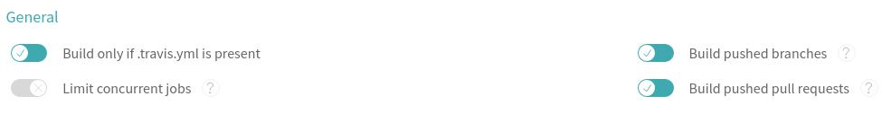

# Unofficial development guide

## Table of contents
  - [Required tools for Java development](#required-tools-for-java-development)
    - [1. Java](#1-java)
    - [2. Maven](#2-maven)
    - [3. Other tools](#3-other-tools)
  - [Template variables](#template-variables)
    - [Global variables](#global-variables)
    - [Variables that apply for portlets, command-line tools, services and JavaFX stand-alone applications](#variables-that-apply-for-portlets-command-line-tools-services-and-javafx-stand-alone-applications)
    - [Variables that apply only for portlets](#variables-that-apply-only-for-portlets)
  - [Layout of the generated projects](#layout-of-the-generated-projects)
  - [What to do once you've generated your project?](#what-to-do-once-youve-generated-your-project)
    - [Write tests, check code coverage](#write-tests-check-code-coverage)
    - [Test your code locally](#test-your-code-locally)
      - [Testing a portlet locally using Jetty](#testing-a-portlet-locally-using-jetty)
      - [Testing other tools locally](#testing-other-tools-locally)
    - [Create a new GitHub repository for your new project](#create-a-new-github-repository-for-your-new-project)
    - [Secure your configuration files before pushing to Git](#secure-your-configuration-files-before-pushing-to-git)
    - [Check that everything worked in Travis-CI.com](#check-that-everything-worked-in-travis-cicom)
    - [Provide encrypted information to Travis CI](#provide-encrypted-information-to-travis-ci)
      - [Maven credentials](#maven-credentials)
      - [Using Vaadin Charts add-on in your portlet](#using-vaadin-charts-add-on-in-your-portlet)
    - [Publish your first version](#publish-your-first-version)
    - [Change default branch](#change-default-branch)
    - [Getting slack notifications from Travis CI (optional)](#getting-slack-notifications-from-travis-ci-optional)

## Required tools for Java development
### 1. Java
Our production and test instances use [OpenJDK 1.8](http://openjdk.java.net/) and this is mirrored in our build system.

Installation of OpenJDK varies across operating systems. So it is strongly advised to read more about how to install OpenJDK in your operating system. Most Linux-based operating systems offer OpenJDK through package managers (e.g., `pacman`, `apt`, `yum`) and [there seems to be an OpenJDK version for Windows available](https://stackoverflow.com/questions/5991508/openjdk-availability-for-windows-os).

If you want to use Oracle's JDK, visit [Oracle's download page](http://www.oracle.com/technetwork/java/javase/downloads/index.html) to get the binaries.

Make sure you install a Java development kit (JDK) and not a Java runtime environment (JRE). 

### 2. Maven
[Apache Maven][maven] is one of those rare tools whose true purpose might be hard to grasp in the beginning, yet it is extremely easy to install. If this is your first time using [Maven][maven], make sure to read [Maven in 5 minutes](https://maven.apache.org/guides/getting-started/maven-in-five-minutes.html) and [Maven's getting started guide](https://maven.apache.org/guides/getting-started/index.html). 

It is up to you to decide whether to install [Maven][maven] using your favorite package manager (you can also install it using [Conda][conda]) or [install it manually](https://maven.apache.org/install.html). In any case, make sure you install the most recent version available.

### 3. Other tools
We use the [Travis CI client][travis-console] to [generate encrypted credentials](#deploying-your-project-as-a-maven-artifact). You can follow [this guide](https://github.com/travis-ci/travis.rb#installation) to get the [Travis CI client][travis-console] installed on your machine.

Installation is straightforward most of the times. If you are using a Fedora-based operating system and you get a "Failed to build gem native extension" error, you might want to [read more about the origin of the problem](https://developer.fedoraproject.org/tech/languages/ruby/gems-installation.html). 

Let's first go through the meaning of each variable. 

## Template variables
### Global variables
**All project types** have references to these variables:
* `author`: your real name, unless you are in the EU witness-protection program or have a really cool nickname, like Rocketboy or Aquagirl.
* `email`: the electronic address that one ought to use if one were willing to contact thee with matters related to the project you are creating.
* `artifact_id`: recall that all [Maven][maven] artifacts (i.e., distributable pieces of software) are identified by three fields, namely, `groupId`, `artifactId`, `version`. This `artifact_id` refers to _that_ `artifactId` in your `pom.xml`. All of our artifacts have the same `groupId`, namely `life.qbic`. Check our naming and versioning conventions guide if you are not sure about which value to enter.
* `display_name`: the "human-friendly" name of your portlet, e.g., _Problem Generator Portlet_, _Project Wizzard (sic) Support Library_, _The "rm -Rf *" Companion Portlet_.
* `version`: if this is a new project, use the provided default, but if you are migrating a project, maybe you should consider a major version update. In any case, consider our naming and versioning conventions guide.
* `short_description`: a short set of words that, when put together in a sentence, explain what your project does. You know, a brief explanation of your project.
* `copyright_holder`: talk to our lawyers if you cannot or will not use the provided default value.

### Variables that apply for portlets, command-line tools, services and JavaFX stand-alone applications
The `main_class_prefix` variable is used **only by `portlet`, `cli`, `service` and `gui` projects**. This kind of projects require a so-called "main (Java) class" with which a framework or a user interacts. 

The value of this variable depends on what kind of project you are developing/porting, but it refers to the [simple name](https://docs.oracle.com/javase/8/docs/api/java/lang/Class.html#getSimpleName--) of a class (i.e., `Sample` would is the simple name of a class whose name is `foo.bar.Sample`). 

If you look into the cookiecutters folder, you will see that there are some template Java files with the following naming schema:

| Project Type  | Template Filenames
|:------------- |:---------------    
| `portlet`     | `...Portlet.java`      
| `cli`         | `...Command.java`<br/>`...EntryPoint.java`<br/>`...Tool.java` 
| `service`     | `...Command.java`<br/>`...EntryPoint.java`<br/>`...Service.java` 
| `gui`         | `...Command.java`<br/>`...EntryPoint.java`<br/>`...Application.java`

This is to have some sort of consistency across all projects. The best way to understand this variable is by providing an example. If you set `NewsGenerator` as the value for `main_class_prefix`, you can expect the following results:

| Project Type  | Generated Filenames
|:------------- |:---------------    
| `portlet`     | `NewsGeneratorPortlet.java`      
| `cli`         | `NewsGeneratorCommand.java`<br/>`NewsGeneratorEntryPoint.java`<br/>`NewsGeneratorTool.java` 
| `service`     | `NewsGeneratorCommand.java`<br/>`NewsGeneratorEntryPoint.java`<br/>`NewsGeneratorService.java` 
| `gui`         | `NewsGeneratorCommand.java`<br/>`NewsGeneratorEntryPoint.java`<br/>`NewsGeneratorApplication.java`

There would be no point, for instance, in having a portlet's main class called `NewsGeneratorPortletPortlet`. No one likes to repeat stuff. I say, no one likes to repeat stuff.

To get a better understanding of the purpose of each generated file, feel free to browse the `sample-code` folder.

### Variables that apply only for portlets
By now, you might have realized that even the simplest portlet requires several configuration files and a cup of coffee. Trying to figure out why your portlet is not deploying or what exactly a configuration file is missing are tasks where developers' time is simply wasted. So we naturally put a lot of effort in first automating portlet generation. This is why the portlets that this tool generates are by far the most complex: you can even configure its dependencies. The following variables **apply only to portlets**:
* `use_openbis_client`: whether your portlet will interact with openBIS through our [openBIS client](https://github.com/qbicsoftware/openbis-client-lib).
* `use_openbis_raw_api`: if you are accessing openBIS _by the book_, then you probably know what you are doing, so this one needs no further explanation.
* `use_qbic_databases`: for now, we define two kinds of databases: openBIS and the rest. This is _the rest_. If your portlet uses a custom database outside openBIS, you probably need this.
* `use_vaadin_charts`: we bought a license to include [Vaadin Charts](https://vaadin.com/directory/component/vaadin-charts) components in our portlets. Make sure that you [include the license code](https://github.com/qbicsoftware/cookiecutter-templates-cli/blob/development/README_DEVELOPMENT.md#using-vaadin-charts-add-on-in-your-portlet) in your `.travis.yml` file.

## Layout of the generated projects
`generate.py` will generate a folder which you can immediately use for development. The contents differ across template types. Here, for the sake of clarity, we will keep using our sample project, `donut-portlet`. Portlets are, by far, the most intricate project types because there are many files you have to configure properly so your portlet can be deployed. Have a look at the generated structure:

```bash
donut-portlet/
├── CODE_OF_CONDUCT.md
├── LICENSE
├── pom.xml
├── README.md
└── src
    ├── main
    │   ├── java
    │   │   └── life
    │   │       └── qbic
    │   │           └── portal
    │   │               └── portlet
    │   │                   └── DonutPortlet.java
    │   ├── resources
    │   │   ├── life
    │   │   │   └── qbic
    │   │   │       └── portlet
    │   │   │           └── AppWidgetSet.gwt.xml
    │   │   ├── log4j2.xml
    │   │   ├── portlet.properties
    │   │   └── developer.properties 
    │   └── webapp
    │       ├── VAADIN
    │       │   └── themes
    │       │       └── mytheme
    │       │           ├── addons.scss
    │       │           ├── mytheme.scss
    │       │           ├── styles.css
    │       │           └── styles.scss
    │       └── WEB-INF
    │           ├── liferay-display.xml
    │           ├── liferay-plugin-package.properties
    │           ├── liferay-portlet.xml
    │           ├── portlet.xml
    │           └── web.xml
    └── test
        └── java
            └── life
                └── qbic
                    └── portal
                        └── portlet
                            └── DonutPortletTest.java
```

In oder to understand more about the process of creating projects from templates by using [Cookiecutter][cookiecutter], compare this [template web.xml](https://github.com/qbicsoftware/cookiecutter-templates-cli/blob/development/cookiecutters/portlet/%7B%7B%20cookiecutter.artifact_id%20%7D%7D/src/main/webapp/WEB-INF/web.xml) with `donut-portlet/src/webapp/WEB-INF/web.xml`. As a side note, the `web.xml` is also referred to as a _servlet descriptor_. Our portlets run on a Liferay portal, which in turn is hosted as a series of web applications in a _servlet container_ (i.e., [Apache Tomcat web server](http://tomcat.apache.org/)). This file is crucial to the proper functioning of a portlet, so it makes sense to automate its generation.

## What to do once you've generated your project?
`generate.py` creates just a sample project. Sadly, you will still have to write your own code, tests and documentation.

### Write tests, check code coverage
The generated folder already contains simple [jUnit](junit) unit tests (i.e., in `src/test/java/life/qbic/portal/portlet/DonutPortletTest.java`). Writing code that tests your code is an important part of the development lifecycle (see: https://makeameme.org/meme/Yo-dawg-I-wgn8jg).

As a general guideline, try to code the _logic_ of your portlet independent of the user interface so you can easily write code that tests your portlet.

[Maven][maven] has been configured to execute unit tests under the `src/test` folder that match the _*Test_ name (e.g., `DonutPortletTest`). To run all unit tests, you use the following command:

```bash
mvn test
```

We use [Cobertura](http://cobertura.github.io/cobertura/) to generate [coverage reports](https://en.wikipedia.org/wiki/Code_coverage). To run the unit tests and generate a code coverage report, simply run:

```bash
mvn cobertura:cobertura
```

Similarly, we have configured the [Maven][maven] plug-ins to run integration tests. These tests are also under the `src/test` folder, but their names must end with _*IntegrationTest_, such as `DonutPortletIntegrationTest`. Running integration tests can be a time-consuming task, so these are, usually, not executed alongside the unit tests. To execute the integration tests, invoke the following command:

```bash
mvn verify
```

### Test your code locally
You can easily run the unit and integration tests for libraries you have written by using the `mvn test` command. This is, more or less, what our build system does. Take a look at the `.travis.yml` file located in the `common-files` if you want to know all implementation details related to how we do continuous integration.

#### Testing a portlet locally using Jetty
Go to the generated folder (i.e., `generated/donut-portlet` in our case) and run:

```bash
mvn jetty:run
```

You should see an output similar to:

```bash
[INFO] Started ServerConnector@67c06a9e{HTTP/1.1,[http/1.1]}{0.0.0.0:8080}
[INFO] Started @30116ms
[INFO] Started Jetty Server
```

Direct your browser to [localhost:8080](http://localhost:8080). If everything went fine, you will see a portlet with several controls. So far so good, congratulations!

Interact with the UI and, if this is your first portlet, we strongly suggest you to try to change a few things in the code and see what happens after you test again.

#### Testing other tools locally
We configured a [Maven][maven] plug-in to generate *stand-alone* JAR filesf for projects of type `cli`, `service` and `gui`. [Maven][maven] will package all of the needed dependencies inside one single JAR file. Let's assume that you used the `cli` template as such:

```bash
./generate.py --type cli artifactId=donut-cli version=1.0.0-SNAPSHOT
```

This will generate your new CLI tool in the `generated/donut-cli` folder. To test your CLI tool locally, you first need to *package* your artifact using [Maven][maven] in the `generated/donut-cli` folder:

```bash
mvn package
```

You then need to use the following command:

```bash
java -jar target/<artifactId>-<version>-jar-with-dependencies.jar
```

That is:

```bash
java -jar target/donut-cli-1.0.0-SNAPSHOT-jar-with-dependencies.jar
```

### Create a new GitHub repository for your new project
You now have a new QBiC project with all the required dependencies and configuration files. You still need to create a remote repository for it, though, so it's available for everyone. Follow [this guide](https://help.github.com/articles/create-a-repo/) to create a repository on GitHub. For this example, we will still use `donut-portlet` as the name of our repository. You need to create your GitHub repository under the [QBiC's GitHub organization](https://github.com/qbicsoftware), so you need writing access.

Make sure to enable *Marketplace apps* in your repository:


### Secure your configuration files before pushing to Git
It might happen that you accidentally pushed a file containing sensitive data. Well, :poop: happens. 

The good part is that this is reversible. The bad part is that, due to compliance with EU law, whenever one of these incidents occurs, the only way to do this right is to not only to [delete all compromised files from the repository](https://help.github.com/en/articles/removing-sensitive-data-from-a-repository), but also to change all compromised passwords, which is a great way to ruin someone's day.

So don't do it, but if you do, or if you discover such an incident, just know that this *sould* be reported.

### Check that everything worked in Travis-CI.com
The generated `donut-portlet` folder contains a `.travis.yml` file that will help you integrate your GitHub repository with [Travis CI][travis], our continuous integration service. Broadly speaking, everytime you _push_ a change into your GitHub repository, [Travis CI][travis] will use the `.travis.yml` file to know what to do. 

Your repository should have been automatically added to our continuous integration system, but there has been a lot of changes in the platform that your experience might differ. Follow these steps to check that everything worked as advertised:

  1. Navigate to (https://travis-ci.com/). Use your GitHub account to authenticate.
  2. Click on your name (upper-right corner). You should see your profile in [Travis CI][travis].
  3. Click the _Sync account_ button:
  
  

  4. Look for your repository. You might want to filter repositories by entering the full name of your repository (i.e., `donut-portlet`) or parts of it.
  5. Once you've found your repository, click on the _Settings_ button () displayed next to it.

If you see the settings page, then it means that everything went fine. Make sure that the general settings of your repository match the ones shown below:



### Provide encrypted information to Travis CI
Any person on the internet can download [Maven][maven] artifacts from our [public Maven repository](https://qbic-repo.am10.uni-tuebingen.de). But in order to upload artifacts to our repository, you will need proper authentication. 

Since all of our code is open source, it would not be a good idea to use cleartext passwords and distribute them in our repositories. This is also true for other private information such as license codes. However, [Travis CI][travis] requires this same information to be present at build time. Luckily, [Travis CI][travis] offers [a simple way to add encrypted environment variables](https://docs.travis-ci.com/user/encryption-keys/). You do not need to fully understand the implementation details to follow this guide, but no one will be angry at you if you do. 

You only need to execute a single command using [the Travis CI console][travis-console] to add an encrypted variable to your `.travis.yml`. Let's say, for instance, that you need to add an environment variable, `NUCLEAR_REACTOR_RELEASE_CODE` whose value is `d0nut5_Ar3_t4sty`. You would have to use the following command:

```bash
travis encrypt "NUCLEAR_REACTOR_RELEASE_CODE=d0nut5_Ar3_t4sty" --add env.global --pro
```

This command will automatically edit `.travis.yml` (if you want edit the file yourself, do not use the `--add env.global` parameter).


#### Maven credentials
To enable [Maven][maven] deployments in [Travis CI][travis], add both `MAVEN_REPO_USERNAME` and `MAVEN_REPO_PASSWORD` as encrypted variables in your `.travis.yml` file like so:

```bash
travis encrypt "MAVEN_REPO_USERNAME=<username>" --add env.global --pro
travis encrypt "MAVEN_REPO_PASSWORD=<password>" --add env.global --pro
```

Ask the people who wrote this guide about the proper values of `<username>` and `<password>`. Encrypted values in [Travis CI][travis] are bound to their GitHub repository, so you cannot simply copy them from other repositories.

#### Using Vaadin Charts add-on in your portlet
This add-on requires you to have a proper license code. If your portlet requires this add-on, add the `VADIN_CHARTS_LICENSE_CODE` as an encrypted variable in `.travis.yml`:

```bash
travis encrypt "VAADIN_CHARTS_LICENSE_CODE=<license-code>" --add env.global --pro
```

Ask around for the license code.

### Publish your first version
In your local GitHub repository directory (i.e., `donut-portlet`) run the following commands:

```bash
git init
git add .
git commit -m "Initial commit before pressing the 'flush radioactive material' button"
git remote add origin https://github.com/qbicsoftware/donut-portlet
git push origin master
git checkout -b development
git push origin development
```

Of course, you must replace `donut-portlet` with the real name of your repository. You can now start using your repository containing your brand new portlet.

### Change default branch
We strongly recommend you to set the `development` branch as your default branch by following [this guide](https://help.github.com/articles/setting-the-default-branch/). 

### Getting slack notifications from Travis CI (optional)
You can edit the `.travis.yml` file to tell Travis to send slack notifications. In your GitHub local repository folder execute:

```bash
travis encrypt "<your GitHub Account>:<token>" --add notifications.slack.rooms
```

Where `<token>` can be obtained by clicking on the "Edit configuration" icon (it looks like a pencil) [in this page](https://qbictalk.slack.com/apps/A0F81FP4N-travis-ci).

[maven]: https://maven.apache.org/
[cookiecutter]: https://cookiecutter.readthedocs.io
[junit]: https://junit.org
[travis]: https://travis-ci.com/
[travis-qbic]: https://travis-ci.com/profile/qbicsoftware
[travis-console]: https://github.com/travis-ci/travis.rb
[conda]: https://conda.io/docs/
